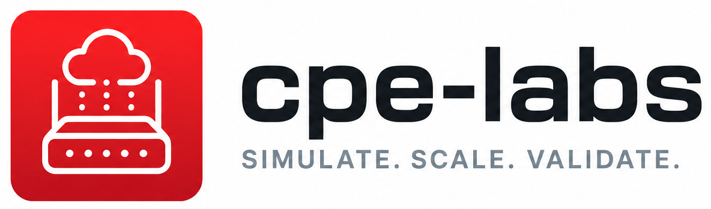

<p align="center">
  
</p>

**Simulate thousands of broadband CPEs, any vendor or model, to test an ACS at realistic scale without hardware.**

Point it at your ACS and it behaves like a fleet of real routers: bootstrap and
periodic Informs, connection requests with Digest auth, counters that climb,
WiFi clients that come and go, sessions that retry with the backoff TR-069
actually specifies. Every vendor's quirks live in a config file, so modelling a
new device is an afternoon, not a code change.

```bash
make build
bin/cpe-sim --profile=profiles/example-sagemcom-fast5598/ --acs-url=http://your-acs:7547/
```

That runs a Sagemcom Fast 5598 speaking TR-181: a PPP WAN drawing from declared
address pools, five Ethernet interfaces, two WiFi radios with associated
stations, and a LAN host table. Change `fleet.count` to 5000 and you have a
fleet, each CPE with its own serial, MAC, IP and drift.

## Why it exists

Testing an ACS properly is hard because real CPEs are inconvenient. You need
hundreds of them to find where your platform buckles, you need a specific
firmware to reproduce a customer's fault, and you need the one vendor whose
`X_0000C5_` extension broke your parser last quarter. Buying that lab is
expensive and it still will not scale.

cpe-labs gives you the fleet in software, and gives you the parts that make a
CPE annoying:

- **Vendor-specific behaviour, declared not coded.** A profile describes the
  parameter tree, which parameters ride each Inform, how values drift, and how
  the device answers a connection request. Two full reference profiles ship: a
  Sagemcom Fast 5598 (TR-181) and an ARRIS NVG578LX (TR-098), both modelled on
  real device exports rather than invented.
- **Fleets from one template.** `fleet.count: 5000` stamps per-CPE serials,
  MACs, hostnames and addresses from declared pools, so every simulated device
  is distinct in the ways an ACS keys on.
- **Movement that looks real.** Counter, drift, enum, uptime and wallclock
  generators keep byte counters climbing, signal strength wandering and uptime
  advancing between sessions, so your dashboards and telemetry pipelines see
  data with shape instead of flat lines.
- **Reproducible when you need it.** Pass `--seed=N` and the whole fleet's
  jitter, drift and client churn replays byte for byte. Leave it out and you get
  a different noisy fleet each run. Both matter: one for regression tests, the
  other for finding what only breaks under real disorder.

## What it speaks

TR-069 (CWMP) over HTTP and SOAP, standards-faithful by default:

| Area | Detail |
|------|--------|
| RPCs | GetParameterValues, SetParameterValues, GetParameterNames, GetParameterAttributes, SetParameterAttributes, AddObject, DeleteObject, Download, Upload, Reboot, FactoryReset, GetRPCMethods |
| Events | Correct event codes per session, BOOTSTRAP delivered once, `M` method events queued, `7 TRANSFER COMPLETE` alongside its Download or Upload event |
| Sessions | One at a time per CPE, mid-session triggers deferred rather than dropped, retry with the TR-069 Table 3 backoff and a stamped RetryCount |
| Connection requests | HTTP listener per CPE with Basic or Digest auth, throttling, and credentials read live from the parameter tree so ACS-driven rotation works |
| Informs | Jittered periodic intervals, or phase-anchored to `PeriodicInformTime` per TR-069 3.2.1.2 when the ACS sets it |
| Auth | Basic and Digest against the ACS, with the challenge answered from tree-sourced credentials |
| Faults | Spec-accurate fault codes, including 9005 for unknown parameters and multi-fault SPV responses |

TR-369 (USP) over MQTT, sharing the same parameter tree:

| Area | Detail |
|------|--------|
| Messages | Get (exact, partial and `*` search paths), Set, Add, Delete, GetInstances, GetSupportedDM, Operate |
| Records | USP Record and Msg protobuf encoding, with per-path error codes rather than a blanket failure when one path in a batch is unknown |
| Notifications | Boot!, OnBoardRequest, and pushed ValueChange, ObjectCreation and ObjectDeletion driven by real subscriptions in `Device.LocalAgent.Subscription.{i}.` |
| Subscriptions | Wildcard reference lists, so one subscription covers every instance including those created later |
| MTP | MQTT 3.1.1 with the R-MQTT.24 reply-to-in-topic convention, which is what brokers without MQTT 5 user properties require |
| Identity | TR-369 2.2 endpoint ids (`os::<OUI><Serial>`), derived from the same profile fields CWMP uses for its Inform DeviceId |

The two stacks run against one tree, not two copies. A counter a generator is
moving reads the same over USP as over CWMP, and a Set from either protocol is
visible to the other, which is what a dual-stack CPE actually does. That also
means a subscription fires on changes a CWMP session caused, and vice versa.

## Get going

```bash
# One TR-181 CPE, minimal profile
bin/cpe-sim --profile=profiles/example-tr181-minimal.yaml --acs-url=http://acs:7547/

# The same fleet, replayable: set fleet.count in the profile, seed the run
bin/cpe-sim --profile=profiles/example-sagemcom-fast5598/ --acs-url=http://acs:7547/ --seed=42

# Answer connection requests
bin/cpe-sim --profile=profiles/example-sagemcom-fast5598/ --acs-url=http://acs:7547/ \
    --cr-bind-addr=0.0.0.0:7547 \
    --cr-publish-path=Device.ManagementServer.ConnectionRequestURL
```

Docker, no clone required — the image ships with the reference profiles at
`/profiles/`:

```bash
docker run --rm ispxhq/cpe-labs --profile=/profiles/example-tr181-minimal.yaml --acs-url=http://acs:7547/
```

To build the image yourself, or for connection-request ports, compose setups
and fleet sizing, see the [Docker guide](docs/guides/docker.md).

Full guides, the profile schema reference and the CLI reference are in
[docs/](docs/guides/quickstart.md). Run `pip install -r requirements.txt && mkdocs serve`
for the browsable site.

## Writing a profile

A profile is the whole product surface. At its simplest:

```yaml
deviceIdPaths:
  manufacturer: Device.DeviceInfo.Manufacturer
  oui:          Device.DeviceInfo.ManufacturerOUI
  productClass: Device.DeviceInfo.ProductClass
  serialNumber: Device.DeviceInfo.SerialNumber

parameters:
  # Every path named in deviceIdPaths has to exist in the tree.
  - path: Device.DeviceInfo.Manufacturer
    value: "ExampleVendor"
  - path: Device.DeviceInfo.ManufacturerOUI
    value: "0011AA"
  - path: Device.DeviceInfo.ProductClass
    value: "ExampleRouter"
  - path: Device.DeviceInfo.SerialNumber
    value: "EX0000001"

  - path: Device.DeviceInfo.UpTime
    type: xsd:unsignedInt
    value: "0"
    writable: true
    generator:
      type: uptime
      interval: 1s

  - path: Device.WiFi.SSID.{i}.Stats.BytesSent
    type: xsd:unsignedInt
    value: "0"
    writable: true
    instances: 2
    generator:
      type: counter
      interval: 30s
      min: 0
      max: 4294967295
      step: 6000000
      jitter: 0.3

informParameters:
  bootstrap: [Device.DeviceInfo.Manufacturer, Device.DeviceInfo.SerialNumber]
  periodic:  [Device.DeviceInfo.UpTime]
```

Profiles can be one file or a directory that loads lexicographically, which is
how the reference profiles split a device across `wifi.yaml`, `wandevice.yaml`
and friends. See [profiles/](profiles/README.md) and the
[schema reference](docs/reference/profile-yaml.md).

## Placeholders

Profiles are templates, and placeholders are how one template becomes many
distinct things. They resolve at two different moments: `{i}` expands
multi-instance objects when the profile loads, and the `{cpe}` family stamps
per-device values when `fleet.count > 1` spawns the fleet.

| Placeholder | Where | Resolves to |
|------|------|------|
| `{i}` | `path` / `value` of a leaf with `instances: N` | Instance index at load: `Radio.{i}` becomes `Radio.1` .. `Radio.N` |
| `{base}`, `{i}`, `{i:N}` | `fleet.serialPattern` | The declared SerialNumber, the CPE index, and the index zero-padded to N digits |
| `{cpe}`, `{cpe:N}` | Any leaf value in a fleet | 1-based CPE index, plain or zero-padded |
| `{cpe:hex:N}`, `{cpe:HEX:N}` | Any leaf value in a fleet | CPE index as zero-padded lower/upper hex |
| `{cpe:mac:N}`, `{cpe:MAC:N}` | Any leaf value in a fleet | N bytes (1..3) of MAC NIC portion: `00:00:07` |
| `{cpe:ipv4:CIDR}`, `{cpe:ipv6:CIDR}` | Any leaf value in a fleet | Nth host in the CIDR: `203.0.113.7` |
| `{cpe:ipv6prefix:SUPER,SUBLEN}` | Any leaf value in a fleet | Nth /SUBLEN prefix carved from SUPER |
| `{cpe_id}` | Any leaf value in a fleet | The assigned CPE id: `cpe-7` |
| `{pool_name}` | Any leaf value in a fleet | This CPE's allocation from the matching `fleet.pools` entry |

Worked examples are in the [multi-CPE guide](docs/guides/multi-cpe.md); exact
validation rules in the [schema reference](docs/reference/profile-yaml.md).

## Development

Go 1.25+ and `golangci-lint`.

```bash
make test       # go test ./...
make test-race  # go test -race ./...
make build      # go build ./...
make lint       # golangci-lint run
```

Wire-format behaviour is pinned by golden files, so a change that alters what
goes on the wire shows up as a reviewable diff. Contributions welcome,
especially profiles for devices we have not modelled: see
[CONTRIBUTING.md](CONTRIBUTING.md).
